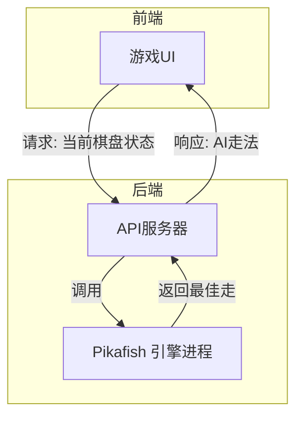

# 中国象棋AI解决方案调研报告

## 执行摘要  
随着人工智能发展，现有中国象棋（象棋）AI可分为以下几类：最简单的硬编码或启发式引擎（如纯评估函数加浅层搜索），传统的搜索算法引擎（基于极小极大/α-β剪枝和评价函数，如象棋小巫师、Elephantfish等），以及现代强化学习驱动的神经网络模型（如基于AlphaZero思路的自对弈策略）。其中，经典搜索引擎（Alpha-Beta + 评估）在能耗和实现难度上代价较低，只需CPU即可运行并易于调节难度；而深度强化学习/神经网络（AlphaZero、JiangJun等）虽具有卓越棋力，但需要大量计算资源和训练成本。近期还出现使用大型语言模型（如GPT-4）控制象棋对局的尝试，但其响应速度慢、成本高、结果不稳定。  

本文将逐类介绍代表性开源项目，如Python版简易引擎Elephantfish【50†L276-L284】【51†L1-L4】、C++/JS版Alpha-Beta引擎（如Xiangqigame【59†L25-L30】、congwenma/xiangqi【41†L291-L299】）、改编Stockfish的强力引擎Pikafish【54†L425-L427】、基于自我对弈的AlphaZero实现【10†】、以及新兴的MCTS+PSRO方法JiangJun【63†L25-L32】等。针对每类方法，我们比较其实现复杂度、运行资源（CPU/GPU、内存）、开发和维护成本，以及调节难度手段。最终给出适合本地或Web应用的低成本整合方案建议（如嵌入轻量搜索引擎或使用WebAssembly版Pikafish），并附架构图和比较表分析不同方案的优劣和适用场景。  

## 1. AI方案分类  
- **启发式/规则引擎**：最简单的形式，通常仅根据固定规则或静态评估函数选择步，如随机或简单陷阱式走法。这类引擎代码量极小（如[Elephantfish]仅124行Python【50†L276-L284】），运行负载非常低，但棋力极其有限；难度调整通常通过缩减思考时间或使用更浅的搜索深度来实现。  
- **经典搜索引擎**：基于极小极大（Minimax）或α-β剪枝的深度搜索，结合手工设计的局面评价函数和各种加速手段（启发式走法排序、置换表、空着剪枝等）。例如C++引擎Xiangqigame【59†L25-L30】和JS引擎congwenma/xiangqi【41†L291-L299】都采用了α-β剪枝和置换表（Xiangqigame使用Zobrist哈希【59†L25-L30】）。这类方法开发和调试难度适中，不需要GPU，易于控制搜索深度来调整实力；其棋力由评价函数和搜索深度决定，可做到较高水平。  
- **蒙特卡罗树搜索（MCTS）及AlphaZero系列**：采用深度神经网络评估和策略网络，结合MCTS进行搜索（如DeepMind的AlphaZero/KataGo模型）。这类方法依赖大规模自我对弈训练，并在推理时进行数百至上千次网络调用【60†L1-L4】。与传统搜索不同，它们可以自动学习复杂评估，不需要手工特征。但计算资源要求极高（训练阶段需要多GPU集群，推理速度也慢），在移动或Web端部署困难。部分研究尝试减少MCTS，如无搜索的Transformer模型【27†L83-L90】或混合α-β与自学习的AlphaBing【48†L301-L304】。代表性项目包括“ChineseChess-AlphaZero”【10†】、阿里巴巴的仿射强化学习等，以及最新的JiangJun方法【63†L25-L32】。  
- **大模型/LLM辅助**：最新思路是直接利用大语言模型（如GPT-4）分析棋盘并生成落子。例如项目“AI Chinese Chess”【56†L299-L302】用GPT-4作为决策引擎，通过输入棋盘FEN和提示语生成下一步，并用不同提示控制难度（初级/中级/高级）【56†L379-L387】。这种方法实现简单（调用API即可），但有几个缺点：响应延迟高（需网络请求），成本昂贵（API调用），且结果稳定性和安全性欠缺。因此更适用于研究或演示，不是常规部署方案。

## 2. 代表开源项目与库  
- **Elephantfish**【50†L276-L284】【51†L1-L4】：纯Python实现的极简象棋引擎，核心仅124行代码。使用MTD(f)二分搜索算法和简单的子力价值表评估【50†L276-L284】【51†L1-L4】。虽然棋力很弱（仅略优于初学者），但代码清晰且易于修改，可作为教学或原型参考。默认每步搜索约5秒，难度可通过修改搜索时间来调节【50†L276-L284】。  
- **Xiangqigame**【59†L25-L30】：一个C++引擎，辅以Python接口。核心使用Minimax加α-β剪枝，结合置换表（Zobrist哈希）加速【59†L25-L30】。结构模块化，支持可修改的搜索深度等参数，适合研究和分析。该项目展示了经典搜索引擎的设计，可编译为库或命令行工具，适合作为强于入门级的搜索AI示例。  
- **congwenma/xiangqi**【41†L291-L299】：基于React/JS的象棋网页应用。其AI采用客户端JavaScript实现的α-β剪枝算法运行于浏览器【41†L291-L299】。该实现证明纯JS环境下也可以实现搜索引擎，开发部署简便，但受限于单线程性能和纯前端环境，棋力与优化空间有限（主要用于演示和教学）。  
- **Pikafish**【54†L425-L427】：Stockfish（国际象棋开源引擎）改编的强力象棋引擎，社区评价非常高【54†L425-L427】。Pikafish开源度高（GitHub上星标1700+），运行速度快，棋力堪比或超过商业象棋程序。它支持多种棋力档（类似Stockfish的skill level调节），适合需要高强度AI的场景。可在PC端或通过WebAssembly（已有社区项目实现Stockfish WASM）部署。  
- **中国象棋Zero (ChineseChess-AlphaZero)**【27†L66-L72】：基于AlphaZero框架的大型项目，需要成百上千张GPU同时训练。它采用自我对弈MCTS+深度神经网络，达到高人水平，但实现与运行成本极高，一般不适合移动端部署。公开仓库有训练代码，但正式模型未明确提供。  
- **AlphaBing**【48†L301-L304】：混合α-β搜索与自学习的轻量级项目。在AlphaZero不可及的限制下提出（无需分布式训练，单机可运行），具有可调节的技能等级【48†L301-L304】。它对硬件要求比纯AlphaZero低，但仍需要安装Python深度学习库，集成到前端成本较高。  
- **JiangJun (PSRO+MCTS)**【63†L25-L32】：清华等团队在2023年提出的新算法，将蒙特卡罗树搜索与策略空间响应算子（PSRO）结合，获得了超强棋力（人机对抗达到大师级，胜率99.4%【63†L25-L32】）。该方法代表最前沿的强化学习研究成果，但实现复杂、资源消耗巨大，不适合个人开发者直接使用。  
- **GPT/Large Model**【56†L299-L302】【56†L379-L387】：如xianminx/ai-chinese-chess项目展示了将GPT-4用于象棋对局的方法。通过将当前棋盘状态输入模型，得到下一步建议，并可在Prompt中注入“初级/中级/高级”标签调节难度【56†L379-L387】。这种方案依赖OpenAI API，易于快速搭建（Next.js示例），但不保证回合质量，也难以离线部署，仅适合探索性用途【56†L299-L302】。

## 3. 实现成本与资源需求  
- **开发难度**：传统搜索引擎相对直观，使用现成库或示例代码（C++/Python/JS）即可实现基本AI。神经网络和强化学习方法对开发者要求高，需要掌握深度学习框架和大量调参。LLM方案开发门槛较低，只需学习调用API，但提示设计技巧影响大。  
- **运行资源**：搜索引擎（Elephantfish、Xiangqigame、Pikafish）主要依赖CPU，多数能在普通PC或移动设备上运行。Pikafish是本地C++编译程序，运行效率高；Elephantfish虽用Python，但计算量小。相比之下，AlphaZero类模型推理需要GPU加速或多线程（推理一次可能需数十毫秒甚至更长），难以在低配设备上实时运行。LLM依赖云端服务，客户端仅需网络，不消耗本地算力，但需要频繁HTTP请求。  
- **训练/维护成本**：强力的RL模型（AlphaZero、JiangJun等）需耗费数周甚至数月的GPU训练时间（动辄数千GPU小时），个人开发者难以承担。相对地，搜索引擎的主要成本在于调试评价函数和优化搜索（开发时间几天到几周不等）；它们无需额外训练，长期维护主要是漏洞修复和策略微调。LLM方案无训练成本，但需要维护API密钥和处理调用开销。  
- **内存需求**：普通搜索引擎占用内存很低（几百MB以内）；Pikafish等大型引擎在运行时也不过数百MB。深度学习模型在推理时可能需要数GB显存。  
- **许可证与依赖**：多数开源象棋引擎遵循GPL/MIT许可证，可自由集成。AlphaZero类研究常基于TensorFlow/PyTorch，需要相应依赖安装；搜索引擎C++可能需相关库；LLM方案只需HTTP库和前端框架即可。

## 4. 难度调节方法  
- **搜索深度/时间控制**：最常见方式是限制搜索深度或思考时间。简单引擎如Elephantfish可通过修改等待时间控制实力【50†L276-L284】；复杂引擎或Pikafish可设置搜索时限或节点数，降低智能。  
- **启发式误差/随机性**：在搜索引擎加入随机化（如每步随机挑选前N好走）或者刻意使用次优评价（降低评估准确度），可模拟弱势水平。  
- **功能开关**：某些引擎支持弃用某些加速特性（如空着剪枝、置换表）来削弱棋力。  
- **ML模型温度调整**：对于神经网络，将输出概率的温度调高，使AI更“冒险”犯错。  
- **Prompt设计（LLM）**：对GPT方案，通过修改提示语（如“我是初学者”、“AI偶尔犯错”）来减弱其选择质量【56†L379-L387】。  
- **预定开局库/残局库**：在所有方案中都可通过添加局部开局或残局库来增强中低水平AI。例如使用数据库，使AI在常见开局上更强，而低水平则减少调用库的几率。

## 5. 低成本集成方案与步骤  
根据现有应用（HTML/JS前端，Node.js后端）和“最小改动、推理级”要求，以下方案可优先考虑：  

**方案1：内置轻量搜索引擎（优选）**  
- **描述**：直接在客户端或服务端集成一个纯搜索AI，如Elephantfish、Xiangqigame或congwenma/xiangqi等。这些项目已有现成代码，可通过JavaScript移植或使用WebAssembly运行。开发者只需调用其API或函数来计算最优落子。  
- **实现步骤**（约5-15人时）：
  1. 选择合适引擎（如JavaScript版alpha-beta引擎或Python版转JS的轻量引擎）。  
  2. 将引擎代码（.js或WASM）纳入项目，或作为Node模块安装。  
  3. 修改游戏逻辑：在后端（或前端）传递当前棋局FEN给AI模块，调用搜索函数，获得AI走法。  
  4. 在前端展示AI走法，并实现思考延时（如等待几百毫秒以模拟思考过程）。  
  5. 根据需要暴露配置，允许用户选择搜索深度/时间来调节难度。  
- **优点**：无需额外服务器，可离线运行，响应快，完全控制。  
- **缺点**：棋力有限，仅能实现中低级AI。

**方案2：Pikafish引擎（强棋力，高成本）**  
- **描述**：使用Pikafish强力引擎。可通过两种方式集成：  
  - *WebAssembly版*：编译Pikafish或Fairy-Stockfish到WASM，直接在浏览器中运行（已有Stockfish WASM示例，可自行修改棋盘逻辑）。  
  - *后端进程*：在Node.js后端启动Pikafish进程，通过UCI协议与之通信，客户端下棋时调用后端接口获得AI走子。  
- **实现步骤**（约20-40人时）：  
  1. 获取Pikafish源码，尝试使用Emscripten编译到WASM，或寻找已有WASM包。  
  2. 如果WASM版不可行，则在服务端编译Pikafish二进制，编写Node.js脚本通过子进程调用（参考WinBoard/UCI协议）。  
  3. 修改后端API：接受FEN或坐标，调用Pikafish得到下一步建议，返回给前端。  
  4. 前端仅需调用接口即可，无需了解引擎细节。  
- **优点**：AI棋力高，可满足高级玩家需求。  
- **缺点**：实现复杂度高（WASM编译困难或需维护进程），运行内存和CPU消耗也高；在移动端设备上可能性能不足。  

**方案3：云端LLM API（快速试验，不推荐）**  
- **描述**：调用OpenAI等云服务接口，使用GPT-4或类似模型来选步【56†L299-L302】。  
- **实现步骤**（约10-15人时）：  
  1. 在后端注册OpenAI账号，获取API密钥。  
  2. 在游戏后端添加对话模块：将当前棋盘（FEN）和所选难度包装成Prompt发给GPT-4。  
  3. 解析模型返回文本中的棋步，校验有效性后应用在棋盘上。  
  4. 控制请求频率和超时，确保实时性。  
- **优点**：无需开发AI算法，质量“看天吃饭”式。  
- **缺点**：每步调用费用高（商业限制），延迟显著，且落子质量参差不齐。**不适合**对局计算，仅做概念验证时参考。  

综合考虑以上方案，在**移动端/Web前端场景**下，一般推荐**方案1**（轻量搜索引擎）作为首选，因其集成成本低、可脱机使用；若项目需要更强棋力且愿意付出编译/运维代价，可选**方案2**（Pikafish）；**方案3**仅供研究或未来升级考虑。

## 6. 推荐方案与风险/收益分析  
- **轻量搜索引擎（推荐）**：推荐选用开源的JS/C++搜索引擎，如将**congwenma/xiangqi**或**Elephantfish**移植集成至现有应用。**收益**：几行代码即可集成，不需GPU或远程服务，响应快且能自由调整实力（修改搜索深度即成）。**风险**：棋力有限（大约相当于业余或高手以下水平）。但该APP如仅需基础对手，这足够。保持代码简洁易维护，迭代代价低。  
- **Stockfish衍生引擎（备选）**：如要极高棋力，可投入时间将**Pikafish**编译为WASM或在后端运行。**收益**：业界顶尖开源棋力，可满足高级用户。**风险**：集成工作量大（多达数周），需要解决跨平台兼容性；运行时耗能大，对低端设备支持差。若项目资源有限，此路径实现成本可能过高。  
- **深度学习模型（不优）**：自研或使用AlphaZero类模型一般成本巨大，不现实。**LLM API**方面虽然开发快，但运营成本高（按调用次数计费）、效果不稳定，且对局迟缓（几秒/步）。因此**除非有特殊需求**，否则不建议将此作为常规方案。  
综上，若目标是在现有Web/App中快速增加合理难度的AI，对用户体验影响小且开发成本低，首推“基于搜索的轻量引擎”方案；若需要展示AI实力或满足强力对手需求，可再考虑Pikafish等方案。

## 7. 方案对比表  

| 类别 / 方案                | 强度/准确度             | 延迟 (时延)         | 内存使用   | 开发成本       | 难度调节性    | 适用环境    |
| ------------------------ | ---------------------- | ------------------ | ---------- | ------------ | ------------- | --------- |
| **简易搜索引擎**<br/>(Elephantfish等) | ★ (初级到业余)          | 低 (<100ms)         | 低 (<100MB) | 低 (数小时)    | ★★★ (深度/时间调整) | 移动/Web客户端 |
| **α-β搜索引擎**<br/>(Xiangqigame, congwenma) | ★★ (业余/高手)         | 低 (数百ms内)      | 低 (数百MB) | 中 (几天至周)   | ★★★ (搜索深度)     | 移动/Web/服务端 |
| **Pikafish (Stockfish)** | ★★★★ (业余到大师级)      | 中 (几百ms)         | 中高 (百MB+) | 高 (编译/集成) | ★★ (可设skill)    | 桌面/Web (WASM) |
| **AlphaZero类 (JiangJun)** | ★★★★★ (人机大师级)      | 高 (多秒/步)       | 高 (GB级)   | 极高 (数月训练) | ★★ (调节MCTS)     | 专业服务器   |
| **GPT-4对局 (LLM)**      | ★★ (策略不稳定)         | 高 (1-5s/步)       | (云端)      | 低 (调用API)   | ★★★ (Prompt控制)  | 云端/Web   |

> 注：表中“★”数量为相对指标，难度调节性指通过参数改变的方便度（★多表示方便）。

## 8. 集成架构示意  

**方案1：嵌入式轻量搜索引擎（JavaScript/WASM）**  
```mermaid
flowchart LR
    subgraph 前端[客户端浏览器/应用]
      A[游戏UI & 逻辑]
      B[JS象棋引擎模块]
    end
    A --> B
    B -->|调用search(board)| A
```
*图示：用户在前端界面下棋，棋局状态传入内置的JavaScript/WASM搜索引擎模块，该模块快速返回AI推荐走法，再由界面更新。开发中只需复制引擎代码并调用其接口，改动前端游戏逻辑即可。*

**方案2：后端Pikafish引擎服务**  

*图示：客户端向后端发送当前棋盘数据，后端API服务器将其转发给本地运行的Pikafish引擎进程（或WASM模块）。Pikafish计算后返回一步，后端再将走法推送给前端界面。此方案可提供高棋力AI，但需要搭建后端服务并处理进程通信。*

上述两种方案分别针对不同需求：方案1适用于快速低成本集成，方案2适用于需要极高棋力且可承担服务器运维的场景。

**参考资料:** 本报告依据近期学术文献和开源项目资料整理，包括象棋AI领域综述【27†L66-L72】【60†L1-L4】、知名引擎项目文档（Xiangqigame【59†L25-L30】、Elephantfish【50†L276-L284】【51†L1-L4】、Pikafish【54†L425-L427】等），以及最新研究（JiangJun【63†L25-L32】、GPT对局项目【56†L299-L302】【56†L379-L387】）等。通过对比各方案的架构和性能特点，给出了面向移动/Web应用的整合建议。